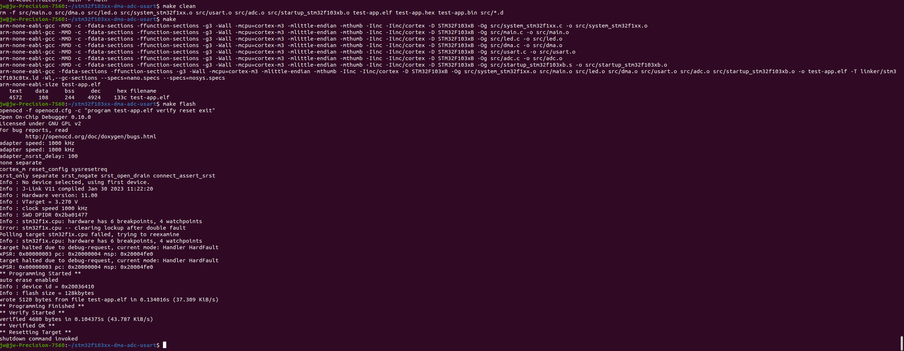
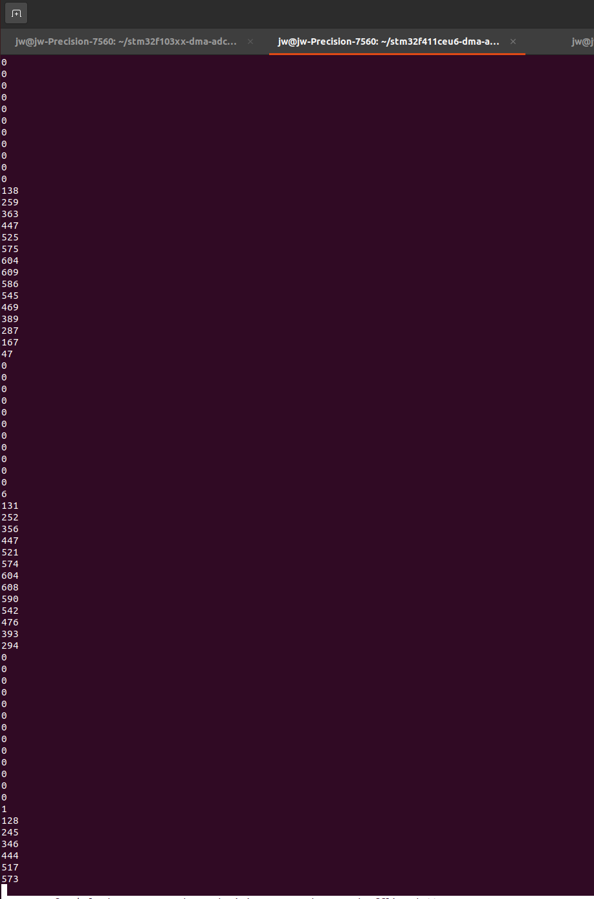

# stm32f103xx-dma-adc-usart

this project uses segger jlink debug probe
stm32f103c8t6 blue pill
ftdi basic 5V or 3.3V (serial ic)
signal generator on PA0

[Reference Manual](https://www.st.com/resource/en/reference_manual/rm0008-stm32f101xx-stm32f102xx-stm32f103xx-stm32f105xx-and-stm32f107xx-advanced-armbased-32bit-mcus-stmicroelectronics.pdf)
[Datasheet](https://www.st.com/resource/en/datasheet/stm32f103c8.pdf)
[Pinout](https://stm32-base.org/boards/STM32F103C8T6-Blue-Pill.html)
[General Documents](https://www.st.com/en/microcontrollers-microprocessors/stm32f103c8.html#documentation)
[References 1](https://github.com/augustofg/STM32F103C8T6-Examples/tree/master)
[References 2](https://github.com/arduino/OpenOCD)
[References 3](https://www.segger.com/products/debug-probes/j-link/technology/interface-description/)
[References 4](https://www.udemy.com/course/microcontroller-dma-programming-fundamentals-to-advanced/)

``` bash
make clean
make

make flash
```

